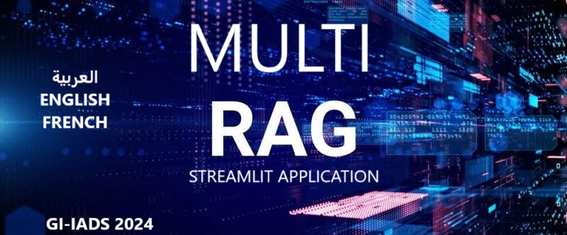
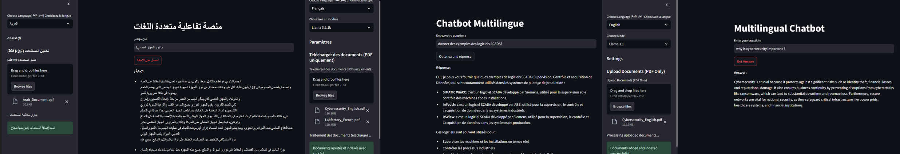

# Multi_RAG: Retrieval-Augmented Generation Application

Welcome to **Multi_RAG**, a multilingual Retrieval-Augmented Generation (RAG) application supporting **French**, **Arabic**, and **English**. This project combines retrieval systems and generative models to create interactive, context-aware responses, implemented in a **Streamlit** application.

---

---

## Key Features
- **Multilingual Support**: Handles queries in French, Arabic, and English seamlessly.
- **Interactive UI**: User-friendly interface built with Streamlit.
- **RAG Model Integration**: Combines retrieval and generation for informed outputs.
- **Architecture Overview**: Well-defined layers for retrieval, generation, and interface.
---

## Documentation
The full documentation is available at [Multi_RAG Documentation](https://multirag.readthedocs.io/).

